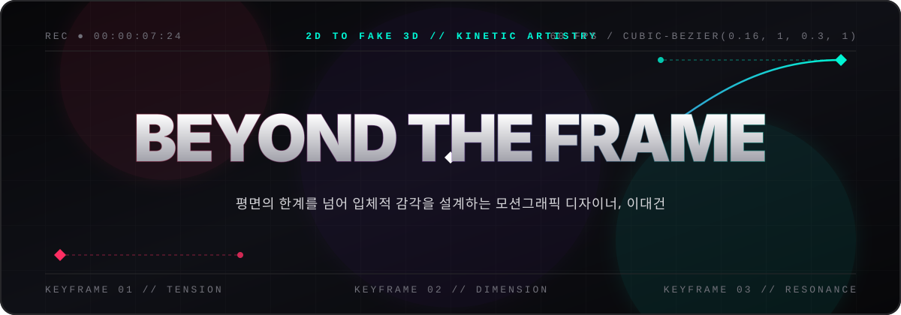

<div align="center">



<br />

### **`[ 00:00:00:00 ]` ── ◆ ── `"정지된 픽셀에 시간이라는 네 번째 차원을 부여합니다."`**

**2D의 평면적 한계를 넘어 입체적 공간감(Fake 3D & 3D)과 감각적인 텐션을 설계하는 모션그래픽 디자이너, 이대건입니다.**

<br />

[](#)
[](#)
[](#)
[](#)
[](#)
[](#)

</div>

<br />

---

## `01 // MANIFESTO` — 디자이너의 시선

> **"좋은 모션은 눈으로 보는 것이 아니라, 리듬과 호흡으로 느끼는 것이다."**

우리가 마주하는 스크린은 가로와 세로로 이루어진 2차원의 평면이지만, 그 안에서 일어나는 움직임은 무한한 깊이를 가질 수 있습니다. 저는 두 개의 키프레임(`◆ ─── ◆`) 사이에 흐르는 **베지어 곡선(Bezier Curve)의 텐션**, **빛과 질감(Texture)의 대조**, 그리고 **2D와 3D의 경계를 허무는 연출**을 통해 평면 위에 입체적인 생명력을 불어넣습니다.

* **Tension & Rhythm:** 속도의 완급 조절(Graph Editing)만으로 시선을 사로잡고 감정의 고조를 이끌어냅니다.
* **Dimension Beyond 2D:** 평면 그래픽에 입체적 구조감을 더하는 **Fake 3D** 기법부터 **Full 3D** 공간 연출까지, 메시지에 가장 적합한 차원을 설계합니다.
* **Visual Storytelling:** 화려한 기교에 그치지 않고, 브랜드가 전하고자 하는 본질적인 서사를 가장 직관적이고 감각적인 시각 언어로 번역합니다.

<br />

---

## `02 // CREATIVE TOOLKIT` — 기술 스택 및 워크플로우

아이디어의 스케치부터 아트워크 제작, 2D/3D 모션 설계, 그리고 최종 사운드 믹싱과 컷 편집까지 **올라운드 모션 파이프라인**을 다룹니다.

<div align="center">

| Category | Tool | Role & Core Competency |
| :---: | :---: | :--- |
| **Core Motion & Compositing** |  | **Kinetic Typography · Fake 3D · VFX Compositing**<br/>정교한 그래프 에디팅 기반의 텐션감 있는 2D 모션, 셰이프 레이어 입체 연출, 텍스처·라이팅 합성 |
| **3D Space & Dynamics** |   | **3D Modeling · Shading · Lighting & Camera Work**<br/>2D 모션과 결합되는 시네마틱 3D 오브젝트 제작, 공간감 있는 카메라 워크 및 스타일라이즈드 렌더링 |
| **Visual Asset & Artwork** |   | **Styleframe Design · Vector Craft · Texture Retouching**<br/>모션의 완성도를 결정짓는 고밀도 스타일프레임 설계, Fake 3D용 벡터 파츠 구조화 및 질감 표현 |
| **Narrative & Rhythm Cut** |  | **Beat Sync · Pacing · Final Mastering**<br/>사운드의 타격감과 영상의 호흡을 일치시키는 컷 편집, 전체 내러티브의 흐름과 페이싱 조율 |

</div>

<br />

---

## `03 // RESOLUTION & FUTURE` — 각오와 미래를 향한 약속

```text
TIMELINE  00:00:01:00 [CHALLENGE] ──────◆────── 00:00:07:00 [GROWTH] ──────◆────── ∞ [BEYOND]
                       └─ 부딪히며 깨지는 과정     └─ 타협 없는 1프레임의 집요함    └─ 기억에 남는 잔상
```

### 🔥 단 1프레임의 오차와도 타협하지 않는 집요함으로
감각적인 결과물은 결코 우연히 만들어지지 않는다고 믿습니다.  
화면 위에서 단 0.1초 만에 스쳐 지나가는 트랜지션 하나를 위해서도 수백 번 그래프의 핸들을 고쳐 잡고, 익숙한 공식에 안주하기보다 매 작업마다 새로운 스타일과 기술적 한계에 먼저 부딪히며 성장합니다. **"부딪힘을 두려워하지 않는 디자이너"**로서, 어제보다 오늘 더 날카롭고 밀도 높은 프레임을 만들어낼 것을 다짐합니다.

### ✨ 더 넓은 캔버스, 더 눈부신 내일을 향하여
지금 제가 찍고 있는 키프레임들은 앞으로 펼쳐질 거대한 타임라인의 시작점일 뿐입니다.  
2D와 3D의 경계를 자유롭게 유영하는 것을 넘어, 웹과 인터랙티브 미디어, 그리고 사람들의 일상이 닿는 모든 스크린 위로 저만의 시각적 세계관을 확장해 나가고자 합니다. 누군가의 시선을 멈추게 하고, 나아가 마음 깊은 곳에 오래도록 아름다운 잔상(Afterimage)으로 남는 작품을 만드는 그날까지—**희망과 열정을 품고 멈추지 않는 렌더링을 이어가겠습니다.**

<br />

---

## `04 // ABOUT THIS REPOSITORY` — `my-link`

이 레포지토리는 모션그래픽 디자이너 **이대건**의 작업물과 크리에이티브 채널을 하나로 연결하는 **인터랙티브 프로필 & 포트폴리오 허브** 프로젝트입니다.

```bash
# Run local development studio
npm install
npm run dev
```

<br />

<div align="center">

**`RENDER COMPLETE // 60 FPS // NO DROPPED FRAMES`**  
Designed & Crafted with Passion by **Lee Dae-geon**

</div>
